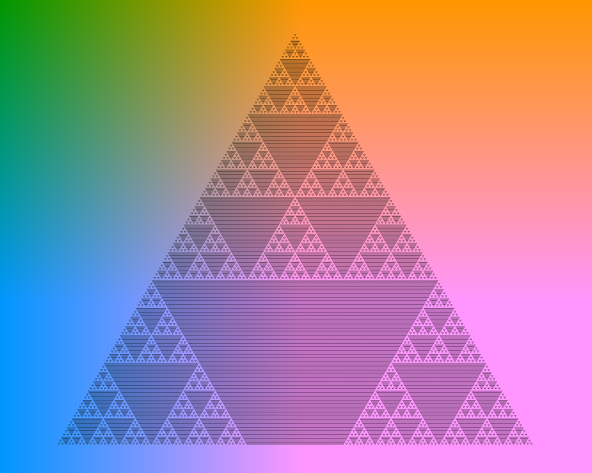

# pascal_triangle

Generates fractal images by using pascal's triangle. It draws a location in the pascal's triangle if the value is divisible by the given number.

Run 
```Cargo run --release <num> <output file>```

Example (num = 3):


